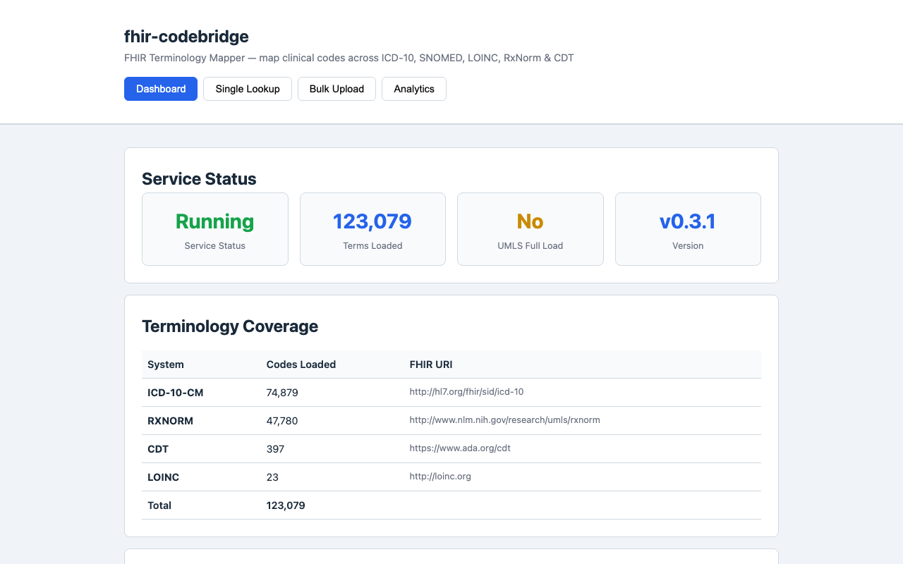
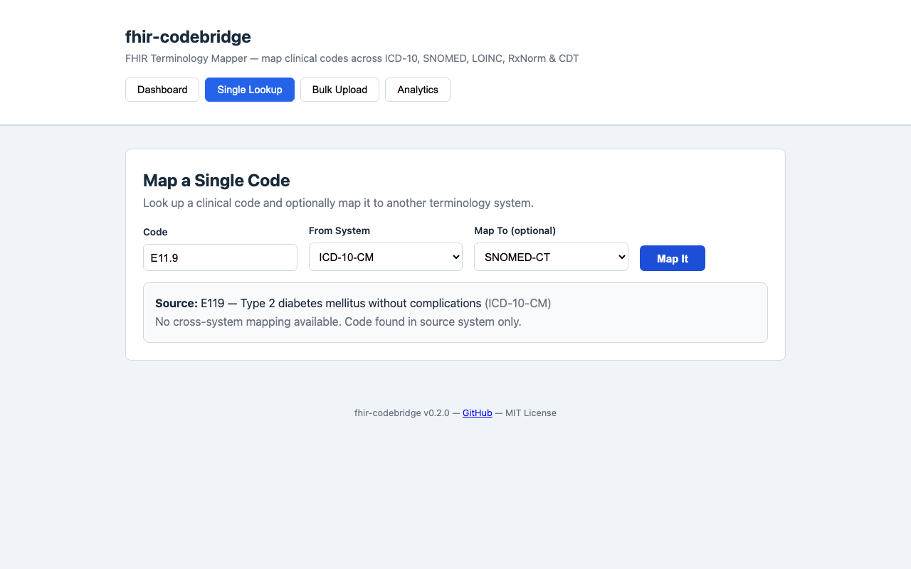
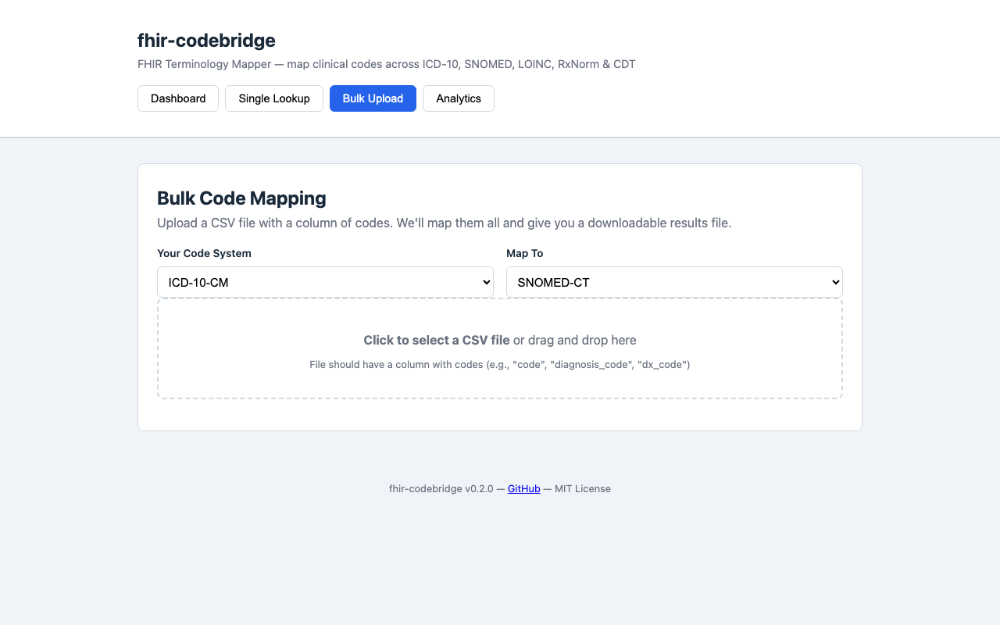
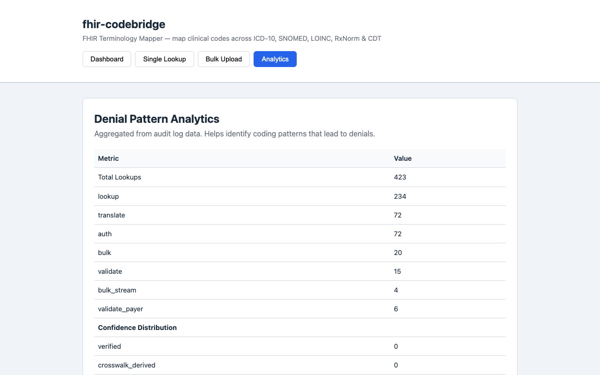

# fhir-codebridge

Open source, Docker-deployable FHIR terminology mapping API. Maps clinical codes across ICD-10-CM, SNOMED-CT, LOINC, RxNorm, and CDT. Bring your own UMLS API key for full terminology coverage.

**Privacy-first:** Runs on your hardware. No PHI leaves your network.

## Screenshots

| Dashboard | Single Lookup |
|-----------|--------------|
|  |  |

| Bulk Upload | Analytics |
|-------------|-----------|
|  |  |

## Quick Start

### Option A: Docker (recommended)
```bash
curl -fsSL https://raw.githubusercontent.com/CiphemonJY/fhir-codebridge/main/docker-quickstart.sh | bash
```

### Option B: pip install
```bash
curl -fsSL https://raw.githubusercontent.com/CiphemonJY/fhir-codebridge/main/quickstart.sh | bash
```

### Option C: Manual
```bash
# Clone
git clone https://github.com/CiphemonJY/fhir-codebridge.git
cd fhir-codebridge

# Configure secrets
cp .env.example .env
# Edit .env: set your API keys (generate with: openssl rand -hex 32)

# Deploy
docker compose up -d

# Verify (should respond in <60 seconds)
curl http://localhost:8000/health

# Test a lookup (ICD-10-CM has 74,879 terms shipped — this always works)
curl -X POST http://localhost:8000/lookup \
  -H "Content-Type: application/json" \
  -H "X-API-Key: YOUR-ADMIN-KEY" \
  -d '{"code": "E11.9", "system": "ICD-10-CM"}'
```

That's it. The service is running on port 8000.

## Web UI

Once deployed, open **http://localhost:8000** in your browser. No terminal needed.

- **Dashboard** — See service status and terminology coverage at a glance
- **Single Lookup** — Search one code and map it to another system (like Google for medical codes)
- **Bulk Upload** — Drag a CSV file with codes, get a results CSV back. Perfect for Excel users.
- **Analytics** — Denial pattern analytics and revenue leakage dashboard

The web UI works in any modern browser (Chrome, Firefox, Safari). No install required — it's served by the same API server.

## Why Use This

| Feature | fhir-codebridge | 3M 360 Encompass | HAPI FHIR | Apache cTAKES |
|---------|----------------|-------------------|-----------|---------------|
| Open source | ✅ MIT | ❌ Commercial | ✅ Apache 2.0 | ✅ Apache 2.0 |
| Docker deploy | ✅ 1 command | ❌ On-prem install | ✅ (Java stack) | ❌ Complex setup |
| Terminology mapping | ✅ Core feature | ✅ Embedded | ❌ Not a mapper | ❌ NLP, not mapping |
| FHIR $translate | ✅ | ❌ Proprietary | ✅ (no maps included) | ❌ |
| Confidence scoring | ✅ 3-tier | ✅ (opaque) | ❌ | ❌ |
| UMLS integration | ✅ BYO key | ✅ (bundled) | ❌ | ❌ |
| Price | Free + BYO key | $100K+/yr | Free | Free |
| Time to deploy | ~15 min | 3-6 months | Hours (but no mapping) | Hours (but NLP) |

fhir-codebridge is the terminology layer that CAC platforms should have had. It unbundles code mapping from monolithic platforms — deploy in 15 minutes, not 6-month RFP cycles.

## What Works Today

| System | Shipped (verified) | With UMLS Loaded |
|--------|-------------------|------------------|
| ICD-10-CM | 74,879 terms ✅ (CMS 2027) | 74,879 |
| RxNorm | 47,780 terms ✅ (NLM API) | ~81,000 |
| CDT | 397 terms ✅ | 397 |
| LOINC (core) | 23 terms ✅ | ~90,000 |
| SNOMED-CT | — (requires UMLS) | ~350,000 |
| Crosswalk | 1,898 verified mappings ✅ | +126,000 (NLM official) |
| **Total** | **123,080 terms + 1,898 mappings** | **~600,000+** |

### How to Load Full Terminology

The system ships with verified starter data from project sources. For full coverage:

1. **UMLS Metathesaurus** (recommended — one file, all systems):
   - Register at [NLM UMLS](https://www.nlm.nih.gov/research/umls/license/license.html) (free for US users)
   - Download MRCONSO.RRF from the [UTS Download Page](https://uts.nlm.nih.gov/uts/)
   - Place in `data/terminology_raw/umls/MRCONSO.RRF`
   - Restart — auto-loads 600K+ terms

2. **SNOMED CT US Edition** (includes official ICD-10-CM mapping):
   - Download from [NLM SNOMED CT](https://www.nlm.nih.gov/healthit/snomedct/us_edition.html)
   - Includes 126,000+ verified SNOMED → ICD-10-CM mappings

3. **Individual systems** (if you only need specific ones):
   - ICD-10-CM: [CMS.gov](https://www.cms.gov/Medicare/Coding/ICD10) (public domain)
   - LOINC: [loinc.org](https://loinc.org/) (free registration)
   - RxNorm: [NLM RxNorm](https://www.nlm.nih.gov/research/umls/rxnorm/) (public domain)

See `data/terminology_parsed/README.md` for detailed instructions.

## API Endpoints

| Endpoint | Method | Description | Auth |
|----------|--------|-------------|------|
| `/` | GET | Web UI (4 tabs: Dashboard, Lookup, Bulk, Analytics) | None |
| `/health` | GET | Deep health check — per-system status, data integrity | None |
| `/stats` | GET | Terminology coverage statistics | Read+ |
| `/systems` | GET | List loaded coding systems | Read+ |
| `/lookup` | POST | Code lookup + cross-system mapping with provenance | Read+ |
| `/$translate` | POST | FHIR ConceptMap $translate operation | Read+ |
| `/validate` | POST | Pre-submission code validation (pass/warning/fail) | Read+ |
| `/bulk` | POST | Bulk CSV upload — auto-detects code column | Read+ |
| `/bulk/stream` | POST | Streaming bulk CSV for 200K+ row files | Read+ |
| `/audit` | GET | Query audit log | Admin only |
| `/metrics` | GET | Prometheus-compatible metrics | None |
| `/terminology/version` | GET | Terminology version metadata (audit compliance) | Read+ |
| `/analytics/denials` | GET | Denial pattern analytics from audit log | Read+ |
| `/payer/rules` | GET | List payer rule sets | Read+ |
| `/payer/rules/{name}` | GET | Get specific payer rule details | Read+ |
| `/validate/payer` | POST | Validate codes against payer-specific rules | Read+ |
| `/docs` | GET | Swagger UI (interactive API docs) | None |

### Example: Lookup ICD-10-CM Code

```bash
curl -X POST http://localhost:8000/lookup \
  -H "Content-Type: application/json" \
  -H "X-API-Key: YOUR-KEY" \
  -d '{"code": "E11.9", "system": "ICD-10-CM"}'
```

Response:
```json
{
  "found": true,
  "source": {"code": "E11.9", "system": "ICD-10-CM", "display": "Type 2 diabetes mellitus without complications"},
  "targets": [],
  "action": "auto_accept",
  "effective_confidence": 1.0,
  "requires_human_review": false,
  "provenance": {"source_authority": "CMS 2027 ICD-10-CM", "mapping_method": "exact_code_lookup", "confidence_level": "verified"}
}
```

### Example: Cross-System Mapping (ICD-10-CM → SNOMED-CT)

Cross-system mappings use the verified crosswalk. Not all codes have crosswalk entries — load UMLS for full coverage.

```bash
curl -X POST http://localhost:8000/lookup \
  -H "Content-Type: application/json" \
  -H "X-API-Key: YOUR-KEY" \
  -d '{"code": "C00.9", "system": "ICD-10-CM", "target_system": "SNOMED-CT"}'
```

### Example: FHIR $translate

```bash
curl -X POST 'http://localhost:8000/$translate' \
  -H "Content-Type: application/json" \
  -H "X-API-Key: YOUR-KEY" \
  -d '{"code": "E11.9", "system": "http://hl7.org/fhir/sid/icd-10-cm", "target_system": "http://snomed.info/sct"}'
```

### Example: Pre-Submission Validation

```bash
curl -X POST http://localhost:8000/validate \
  -H "Content-Type: application/json" \
  -H "X-API-Key: YOUR-KEY" \
  -d '{"codes": [{"code": "E11.9", "system": "ICD-10-CM"}], "target_system": "SNOMED-CT"}'
```

## Confidence Scoring

Every mapping includes a confidence score and routing action:

| Score | Action | Description |
|-------|--------|-------------|
| ≥ 95% | `auto_accept` | Verified mapping — safe for automated use |
| 70-95% | `review` | Likely match — human should confirm |
| < 70% | `reject` | No reliable match — code manually |

The RAG lookup engine (verified database) returns 100% accuracy on known terms. The neural model (experimental, opt-in) handles unknown terms at ~65% accuracy — every result is flagged with a confidence score, so low-confidence mappings are never silently accepted.

See [BENCHMARK.md](BENCHMARK.md) for detailed results.

## UMLS Integration

The National Library of Medicine provides free access to terminology data for US users:

1. **UMLS Metathesaurus** — one file provides all systems (SNOMED-CT, ICD-10-CM, LOINC, RxNorm, CPT, 200+ vocabularies)
   - Register: https://www.nlm.nih.gov/research/umls/license/license.html
   - Download: https://uts.nlm.nih.gov/uts/
   - Place `MRCONSO.RRF` in `data/terminology_raw/umls/`
   - Restart the service — auto-loads 600K+ terms

2. **SNOMED CT US Edition** — includes the official SNOMED → ICD-10-CM mapping (126K+ concepts)
   - Download: https://www.nlm.nih.gov/healthit/snomedct/us_edition.html

3. **UMLS UTS API Key** — for live lookups of codes not in your local database
   - Register: https://uts.nlm.nih.gov/uts/signup
   - Add `CODEBRIDGE_UMLS_API_KEY=your-key` to `.env`

Without UMLS: 123K+ verified terms (74K ICD-10-CM from CMS, 47K RxNorm from NLM API, 397 CDT, 23 LOINC core) + 1,898 crosswalk mappings. SNOMED-CT and full LOINC require UMLS.
With UMLS: full coverage (600K+ terms, cross-system mappings, NLM official SNOMED→ICD-10-CM).

Your API key is never stored or logged. See [SNOMED_LICENSE.md](SNOMED_LICENSE.md) for licensing details.

## Client SDK

Install the Python client library:

```bash
pip install fhir-codebridge
```

```python
from codebridge import CodeBridge

# Connect to your service
cb = CodeBridge("http://localhost:8000", api_key="your-key")

# Single code lookup
result = cb.lookup("E11.9", system="ICD-10-CM")
print(result["source"]["display"])  # "Type 2 diabetes mellitus without complications"

# Bulk map a CSV of codes
cb.bulk_map("diagnoses.csv", source_system="ICD-10-CM", output="results.csv")

# Check service status
stats = cb.stats()
print(f"{stats['total_terms']:,} terms loaded")
```

Or use the CLI:
```bash
codebridge health --url http://localhost:8000
codebridge lookup E11.9 --system ICD-10-CM
codebridge bulk codes.csv --source ICD-10-CM --output results.csv
```

## Architecture

```
Layer 1: Verified Mapping Database → 100% on known terms (RAG)
Layer 2: UMLS UTS API (if key provided) → NLM-verified cross-system mappings (rate-limited + cached)
Layer 3: Neural Prediction Model (experimental, opt-in) → ~65% on unknown terms
Layer 4: Confidence Scoring → auto_accept / review / reject
Layer 5: Human-in-the-Loop → corrections feed back into training data
```

## Security

- **API Key Auth:** Role-based access (admin / read). Set via env var or Docker secret.
- **Audit Logging:** Every request logged (JSON Lines). Queryable via `/audit` endpoint. HIPAA §164.312(b) compliant.
- **Docker Secrets:** API keys stored as files, not plaintext env vars.
- **Rate Limiting:** In-memory token bucket (100 req/60s default, configurable).
- **UMLS Guardrail:** Rate-limited (5 req/s) + cached (1h TTL). Patient context stripped before external API calls.
- **On-Premises:** No data leaves your network. No cloud dependencies.

See [INSTALL.md](INSTALL.md) for production hardening checklist and [SECURITY.md](SECURITY.md) for vulnerability reporting.

## Deployment

- **Quick Start:** See above
- **Full Guide:** [INSTALL.md](INSTALL.md) — prerequisites, UMLS key guide, firewall config, production hardening
- **Examples:** `examples/` directory — curl scripts, Python client, Postman collection
- **nginx TLS:** `examples/nginx/nginx.conf` — reverse proxy with TLS termination
- **Training Materials:** `docs/training/` — quickstart guide, glossary, admin guide
- **Commercial Services:** [COMMERCIAL.md](COMMERCIAL.md) — implementation consulting, managed hosting, training

## Project Status

**v0.4.1** — actively maintained. Seeking pilot deployments for validation feedback.

Roadmap:
- ✅ RAG lookup engine (100% benchmark on known terms)
- ✅ 16 API endpoints including FHIR $translate, bulk CSV, streaming
- ✅ Web UI (Dashboard, Lookup, Bulk Upload, Analytics)
- ✅ RBAC + audit logging + Docker secrets
- ✅ Pre-loaded terminology (123K+ verified terms + 1,898 crosswalk mappings)
- ✅ Mapping provenance + terminology version metadata (Tier 0)
- ✅ Structured JSON logging + rate limiting + training materials (Tier 1)
- ✅ Pre-submission validation + denial analytics + streaming bulk + scheduled updates (Tier 2)
- ✅ Payer-specific rule engine + revenue leakage dashboard (Tier 3)
- ✅ Client SDK (pip-installable) + CI/CD (GitHub Actions)
- ⬜ UMLS MRCONSO.RRF loader (hospital-provided full terminology)
- ⬜ EHR connector templates
- ⬜ Operational runbook

See [CONTRIBUTING.md](CONTRIBUTING.md) for how to contribute and [CHANGELOG.md](CHANGELOG.md) for version history.

## License

MIT — see [LICENSE](LICENSE)

## Disclaimer

This software is for research and development purposes. It is NOT a certified medical device and should not be used for autonomous clinical decision-making. All mappings with confidence < 95% require human review before use in billing or clinical documentation.
